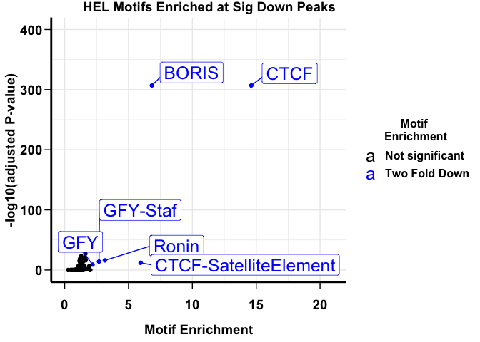
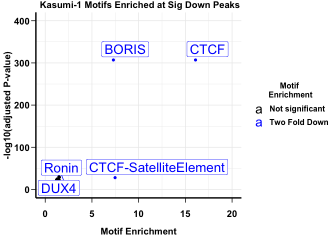

031122-ATAC-seq\_MotifEnrichment\_modifiedFunction\_HodgesLab
================
Monica
3/11/2022

# Motif Enrichment of ATAC-seq 6h dTAG-47

### Packages loaded

``` r
library(tidyverse)
```

    ## Warning: package 'tidyr' was built under R version 4.0.5

    ## Warning: package 'readr' was built under R version 4.0.5

    ## Warning: package 'dplyr' was built under R version 4.0.5

``` r
library(ggplot2)
library(dplyr)
library(ggrepel)
```

## Function

This function was provided to me from Emily Hodge’s Lab

``` r
#function
format_motif_results <- function(df){
  df <- mutate(df, percentTargetNum = (as.numeric(gsub("%", "", percentTarget, fixed = TRUE))/100))
  df <- mutate(df, percentBackgroundNum = (as.numeric(gsub("%", "", percentBackground, fixed = TRUE))/100))
  df <- mutate(df, percentFold = (percentTargetNum/percentBackgroundNum))
  df <- mutate(df, Motif = gsub('\\(.*', "", MotifName))
  df <- dplyr::filter(df, percentFold != "Inf")
  df$Motif <- factor(df$Motif,levels=rev(unique(df$Motif)))
  # Plot with GGPlot
  return(df)
}
```

#### Created my own ggplot theme with grid

function `theme_monica` used to create the proper graph

``` r
theme_monica <- function(){
  theme_minimal() %+replace%    #replace elements we want to change
    #font <- "Times", 
    theme(
      
  plot.title = element_text(             #title
                  #family = font,              #set font family
                   size = 14,                #set font size
                   face = 'bold',            #bold typeface
                   hjust = 0.75,                #left align
                   vjust = 2.25),               #raise slightly
      
plot.subtitle = element_text(          #subtitle
                   #family = font,            #font family
                   size = 14),               #font size
      
plot.caption = element_text(           #caption
                   #family = font,            #font family
                   size = 10,                 #font size
                   hjust = 1),               #right align
      legend.text = element_text(             #axis titles
                   #family = font,            #font family
                   face = 'bold',
                   size = 12),
      legend.title = element_text(             #axis titles
                   #family = font,            #font family
                   face = 'bold',
                   size = 12),
      axis.title = element_text(             #axis titles
                   #family = font,            #font family
                   face = 'bold',
                   size = 14),               #font size
      
      axis.text = element_text(              #axis text
                   #family = font,            #axis famuly
                   face = 'bold',
                   size = 14),                #font size
      axis.line = element_line(size = 1, 
                         colour = "black",
                         linetype = 1),

      axis.ticks = element_line(size = 0.5,
                              color="black") , 

      axis.ticks.length = unit(.25, "cm"),
      
      axis.text.x = element_text(            #margin for axis text
                    margin=margin(10, b = 12))
      
    )}
```

# Loading Tables of ATAC-seq motifs

These are the knownresults.txt files from the homer output directory
from using the command findMotifsGenome.pl

``` r
Kasknownresults24hdn <- readr::read_tsv("/Volumes/Bomber4TB/7567-ATAC/7567-motifs/7567-ATACq0.05_24hrvs0hr.DESEQ2norm.sigdn.findMotifssizegivenmask/knownResults.newheader.txt")

Kasknownresults24hup <- readr::read_tsv("/Volumes/Bomber4TB/7567-ATAC/7567-motifs/7567-ATACq0.05_24hrvs0hr.DESEQ2norm.sigup.findMotifssizegivenmask/knownResults.newheader.txt")

Kasknownresults6hdn <- readr::read_tsv("/Volumes/Bomber4TB/7567-ATAC/7567-motifs/7567-ATACq0.05_6hrvs0hr.DESEQ2norm.sigdn.findMotifssizegivenmask/knownResults.newheader.txt")

Kasknownresults6hup <- readr::read_tsv("/Volumes/Bomber4TB/7567-ATAC/7567-motifs/7567-ATACq0.05_6hrvs0hr.DESEQ2norm.sigup.findMotifssizegivenmask/knownResults.newheader.txt")

HELknownresults6hdn <- readr::read_tsv("/Volumes/GEO_DISK/7018-ATAC-seq/7018-HEL-hg19_sigdn_q0.05combgenrich.normDESEQ2.sizegiven.mask/knownResults.newheader.txt")

HELknownresults6hup <- readr::read_tsv("/Volumes/GEO_DISK/7018-ATAC-seq/7018-HEL-hg19_sigup_q0.05combgenrich.normDESEQ2.sizegiven.mask/knownResults.newheader.txt")

LY1knownresults6hdn <- readr::read_tsv("/Volumes/GEO_DISK/7018-ATAC-seq/7018-LY1-hg19_sigdn_q0.05combgenrich.normDESEQ2.sizegiven.mask/knownResults.newheader..txt")

LY1knownresults6hup <- readr::read_tsv("/Volumes/GEO_DISK/7018-ATAC-seq/7018-LY1-hg19_sigup_q0.05combgenrich.normDESEQ2.sizegiven.mask/knownResults.newheader.txt")
```

## OCI-LY1 6 hour ATAC-seq Motif enrichment

``` r
LY1knownresults6hdn_motif <- format_motif_results(LY1knownresults6hdn)
LY1knownresults6hdn_motif$Motif <- as.character(LY1knownresults6hdn_motif$Motif)
LY1knownresults6hdn_motif$diffexpressed <- "Not significant"
# if FoldChange > 0.6 and pvalue < 0.05, set as "UP" 
LY1knownresults6hdn_motif$diffexpressed[LY1knownresults6hdn_motif$percentFold >= 2 & LY1knownresults6hdn_motif$`q-value (Benjamini)` < 0.05] <- "Significantly Down"

LY1knownresults6hdn_motif$motiflabels <- NA
LY1knownresults6hdn_motif$motiflabels[LY1knownresults6hdn_motif$diffexpressed != "Not significant"] <- LY1knownresults6hdn_motif$Motif[LY1knownresults6hdn_motif$diffexpressed != "Not significant"]


LY1dn <- ggplot(data=LY1knownresults6hdn_motif, aes(x=percentFold, y=-log10(pvalue), col = diffexpressed, label =motiflabels )) + 
    geom_point() + theme_monica() +   geom_label_repel(direction = "both",force = 10, size = 7,max.overlaps = 12, label.padding = 0.3) + scale_color_manual(values = c("black", "blue")) +
  labs(title = "LY1 Motifs Enriched at Sig Down Peaks",
       x = "MotifEnrichment",
       y = "-log10(adjusted P-value)",
       colour = "Motif \nEnrichment") + ylim(0,400) +
  xlim(0,20)
LY1dn
```

    ## Warning: Removed 437 rows containing missing values (geom_label_repel).


``` r
#ggsave(plot = LY1dn, filename = "/Volumes/Bomber4TB/Rgraphs/ATAC_fig_plots/LY1.motif.enrichment.inv.6h.down.png",  scale = 1, width = 7,
#  height = 5,
#  units = "in",
#  dpi = 300,
#  type = "cairo", 
#  bg = "white")


LY1knownresults6hup_motif <- format_motif_results(LY1knownresults6hup)
LY1knownresults6hup_motif$Motif <- as.character(LY1knownresults6hup_motif$Motif)
LY1knownresults6hup_motif$diffexpressed <- "Not significant"
# if FoldChange > 0.6 and pvalue < 0.05, set as "UP" 
LY1knownresults6hup_motif$diffexpressed[LY1knownresults6hup_motif$percentFold >= 2 & LY1knownresults6hup_motif$`q-value (Benjamini)` < 0.05] <- "Significantly Up"

LY1knownresults6hup_motif$motiflabels <- NA
LY1knownresults6hup_motif$motiflabels[LY1knownresults6hup_motif$diffexpressed != "Not significant"] <- LY1knownresults6hup_motif$Motif[LY1knownresults6hup_motif$diffexpressed != "Not significant"]


LY1up <- ggplot(data=LY1knownresults6hup_motif, aes(x=percentFold, y=-log10(pvalue), col = diffexpressed, label =motiflabels )) + 
    geom_point() + theme_monica() +   geom_label_repel(direction = "both",force = 10, max.overlaps = 12, label.padding = 0.3) + scale_color_manual(values = c("black", "red")) +
  labs(title = "LY1 Motifs Enriched at Sig Up Peaks",
       x = "MotifEnrichment",
       y = "-log10(adjusted P-value)",
       colour = "Motif \nEnrichment") + ylim(0,400) +
  xlim(0,20)
LY1up
```

    ## Warning: Removed 428 rows containing missing values (geom_label_repel).

    ## Warning: ggrepel: 9 unlabeled data points (too many overlaps). Consider
    ## increasing max.overlaps


``` r
#Combining the enrichment plots 
Ly1_MotifsEnrichmentv2 <- rbind(LY1knownresults6hdn_motif,LY1knownresults6hup_motif)

LY1motifsv2 <- ggplot(data=Ly1_MotifsEnrichmentv2, aes(x=percentFold, y=-log10(pvalue), col = diffexpressed, label = motiflabels )) + 
    geom_point() + theme_monica() +  
  geom_label_repel(direction = "both",force = 10, max.overlaps = 12, label.padding = 0.3) +
  scale_color_manual(values = c("black", "blue", "red")) +
  labs(title = "LY1 Motifs Enriched At Up and Down Peaks",
       x = "MotifEnrichment",
       y = "-log10(adjusted P-value)",
       colour = "Motif \nEnrichment") + ylim(0,400) +
  xlim(0,20)
LY1motifsv2
```

    ## Warning: Removed 865 rows containing missing values (geom_label_repel).
    ## ggrepel: 9 unlabeled data points (too many overlaps). Consider increasing max.overlaps


``` r
#ggsave(plot = LY1motifsv2, filename = "/Volumes/Bomber4TB/Rgraphs/ATAC_fig_plots/LY1.motif.enrichment.inv.6h.difflegendv2.png",  scale = 1, width = 7,
#  height = 5,
#  units = "in",
#  dpi = 300,
# type = "cairo", 
#  bg = "white")
```

## HEL 6 hour ATAC-seq motif enrichment

``` r
HELknownresults6hdn_motif <- format_motif_results(HELknownresults6hdn)
HELknownresults6hdn_motif$Motif <- as.character(HELknownresults6hdn_motif$Motif)
HELknownresults6hdn_motif$diffexpressed <- "Not significant"
# if FoldChange > 0.6 and pvalue < 0.05, set as "UP" 
HELknownresults6hdn_motif$diffexpressed[HELknownresults6hdn_motif$percentFold >= 2 & HELknownresults6hdn_motif$`q-value (Benjamini)` < 0.05] <- "Two Fold Down"

HELknownresults6hdn_motif$motiflabels <- NA
HELknownresults6hdn_motif$motiflabels[HELknownresults6hdn_motif$diffexpressed != "Not significant"] <- HELknownresults6hdn_motif$Motif[HELknownresults6hdn_motif$diffexpressed != "Not significant"]


HELdn <- ggplot(data=HELknownresults6hdn_motif, aes(x=percentFold, y=-log10(pvalue), col = diffexpressed, label =motiflabels )) + 
    geom_point() + theme_monica() +   geom_label_repel(label.padding = 0.3,direction = "both", nudge_x = 3, nudge_y = 20,force = 100, force_pull = 50, max.overlaps = 10,  size = 6.5, min.segment.length = 0,box.padding = 0.5) + scale_color_manual(values = c("black", "blue")) +
  labs(title = "HEL Motifs Enriched at Sig Down Peaks",
       x = "Motif Enrichment",
       y = "-log10(adjusted P-value)",
       colour = "Motif \nEnrichment") + ylim(0,400) +
  xlim(0,21)
HELdn
```

    ## Warning: Removed 434 rows containing missing values (geom_label_repel).



``` r
#ggsave(plot = HELdn, filename = "/Volumes/Bomber4TB/Rgraphs/ATAC_fig_plots/HEL.motif.enrichement.DOWN.6h.png",  scale = 1, width = 7,
#  height = 5,
#  units = "in",
#  dpi = 300,
#  type = "cairo", 
#  bg = "white")

HELknownresults6hup_motif <- format_motif_results(HELknownresults6hup)
HELknownresults6hup_motif <- as.data.frame(HELknownresults6hup_motif)
HELknownresults6hup_motif$Motif <- as.character(HELknownresults6hup_motif$Motif)
HELknownresults6hup_motif$diffexpressed <- "Not significant"
# if FoldChange > 0.6 and pvalue < 0.05, set as "UP" 
HELknownresults6hup_motif$diffexpressed[HELknownresults6hup_motif$percentFold >= 2 & HELknownresults6hup_motif$`q-value (Benjamini)` < 0.05] <- "Two Fold Up"


HELknownresults6hup_motif$motiflabels <- NA
HELknownresults6hup_motif$motiflabels[HELknownresults6hup_motif$diffexpressed != "Not significant"] <- HELknownresults6hup_motif$Motif[HELknownresults6hup_motif$diffexpressed != "Not significant"]


HELup <- ggplot(data=HELknownresults6hup_motif, aes(x=percentFold, y=-log10(pvalue), col = diffexpressed, label =motiflabels )) + 
    geom_point() + theme_monica() +   geom_label_repel(direction = "both",force = 10, max.overlaps = 12, label.padding = 0.3) + scale_color_manual(values = c("black", "red")) +
  labs(title = "HEL Motifs Enriched at Sig Up Peaks",
       x = "Motif Enrichment",
       y = "-log10(adjusted P-value)",
       colour = "Motif \nEnrichment") + ylim(0,400) +
  xlim(0,20)
HELup
```

    ## Warning: Removed 419 rows containing missing values (geom_label_repel).

    ## Warning: ggrepel: 12 unlabeled data points (too many overlaps). Consider
    ## increasing max.overlaps


``` r
HEL_MotifsEnrichmentv2 <- rbind(HELknownresults6hdn_motif,HELknownresults6hup_motif)

HELmotifsv2 <- ggplot(data=HEL_MotifsEnrichmentv2, aes(x=percentFold, y=-log10(pvalue), col = diffexpressed, label = motiflabels )) + 
    geom_point() + theme_monica() + geom_label_repel(direction = "both",force = 10, max.overlaps = 10, label.padding = 0.3) + scale_color_manual(values = c("black", "blue", "red")) +
  labs(title = "HEL Motifs Enriched At Up and Down Peaks",
       x = "Motif Enrichment",
       y = "-log10(adjusted P-value)",
       colour = "Motif \nEnrichment") + 
  ylim(0,400) +
  xlim(0,20)
HELmotifsv2
```

    ## Warning: Removed 853 rows containing missing values (geom_label_repel).

    ## Warning: ggrepel: 18 unlabeled data points (too many overlaps). Consider
    ## increasing max.overlaps


## Kasumi-1 6 hour ATAC-seq peak motif enrichment

``` r
Kasknownresults6hdn_motif <- format_motif_results(Kasknownresults6hdn)
Kasknownresults6hdn_motif$Motif <- as.character(Kasknownresults6hdn_motif$Motif)
Kasknownresults6hdn_motif$diffexpressed <- "Not significant"
# if FoldChange > 0.6 and pvalue < 0.05, set as "UP" 
Kasknownresults6hdn_motif$diffexpressed[Kasknownresults6hdn_motif$percentFold >= 2 & Kasknownresults6hdn_motif$`q-value (Benjamini)` < 0.05] <- "Two Fold Down"

Kasknownresults6hdn_motif$motiflabels <- NA
Kasknownresults6hdn_motif$motiflabels[Kasknownresults6hdn_motif$diffexpressed != "Not significant"] <- Kasknownresults6hdn_motif$Motif[Kasknownresults6hdn_motif$diffexpressed != "Not significant"]


Kas6hdn <- ggplot(data=Kasknownresults6hdn_motif, aes(x=percentFold, y=-log10(pvalue), col = diffexpressed, label =motiflabels )) + 
    geom_point() + theme_monica() +   geom_label_repel(direction = "both",force = 10, max.overlaps = 12, label.padding = 0.3, size = 7) + scale_color_manual(values = c("black", "blue")) +
  labs(title = "Kasumi-1 Motifs Enriched at Sig Down Peaks",
       x = "Motif Enrichment",
       y = "-log10(adjusted P-value)",
       colour = "Motif \nEnrichment") + ylim(0,400) +
  xlim(0,20)
Kas6hdn
```

    ## Warning: Removed 435 rows containing missing values (geom_label_repel).



``` r
#ggsave(plot = Kas6hdn, filename = "/Volumes/Bomber4TB/Rgraphs/ATAC_fig_plots/Kasumi1.motif.enrichement.6h.DOWN.png",  scale = 1, width = 7,
#  height = 5,
#  units = "in",
#  dpi = 300,
#  type = "cairo", 
#  bg = "white")

Kasknownresults6hup_motif <- format_motif_results(Kasknownresults24hup)
Kasknownresults6hup_motif <- as.data.frame(Kasknownresults6hup_motif)
Kasknownresults6hup_motif$Motif <- as.character(Kasknownresults6hup_motif$Motif)
Kasknownresults6hup_motif$diffexpressed <- "Not significant"
# if FoldChange > 0.6 and pvalue < 0.05, set as "UP" 
Kasknownresults6hup_motif$diffexpressed[Kasknownresults6hup_motif$percentFold >= 2 & Kasknownresults6hup_motif$`q-value (Benjamini)` < 0.05] <- "Two Fold Up"


Kasknownresults6hup_motif$motiflabels <- NA
Kasknownresults6hup_motif$motiflabels[Kasknownresults6hup_motif$diffexpressed != "Not significant"] <- Kasknownresults6hup_motif$Motif[Kasknownresults6hup_motif$diffexpressed != "Not significant"]


Kas6up <- ggplot(data=Kasknownresults6hup_motif, aes(x=percentFold, y=-log10(pvalue), col = diffexpressed, label =motiflabels )) + 
    geom_point() + theme_monica() +   geom_label_repel(direction = "both",force = 10, max.overlaps = 12, label.padding = 0.3) + scale_color_manual(values = c("black", "red")) +
  labs(title = "Kasumi-1 Motifs Enriched at Sig Up Peaks",
       x = "Motif Enrichment",
       y = "-log10(adjusted P-value)",
       colour = "Motif \nEnrichment") + ylim(0,400) +
  xlim(0,20)
Kas6up
```

    ## Warning: Removed 407 rows containing missing values (geom_label_repel).

    ## Warning: ggrepel: 26 unlabeled data points (too many overlaps). Consider
    ## increasing max.overlaps


``` r
# combining the motif enrichments from up and down peaks 
Kas6_MotifsEnrichmentv2 <- rbind(Kasknownresults6hdn_motif,Kasknownresults6hup_motif)

Kas6motifsv2 <- ggplot(data=Kas6_MotifsEnrichmentv2, aes(x=percentFold, y=-log10(pvalue), col = diffexpressed, label = motiflabels )) + 
    geom_point() + theme_monica() + geom_label_repel(direction = "both", max.overlaps = 10, label.padding = 0.25) + scale_color_manual(values = c("black", "blue", "red")) +
  labs(title = "Kasumi-1 Motifs Enriched At Up and Down Peaks",
       x = "Motif Enrichment",
       y = "-log10(adjusted P-value)",
       colour = "Motif \nEnrichment") + 
  ylim(0,400) +
  xlim(0,18)
Kas6motifsv2
```

    ## Warning: Removed 842 rows containing missing values (geom_label_repel).

    ## Warning: ggrepel: 31 unlabeled data points (too many overlaps). Consider
    ## increasing max.overlaps


``` r
#ggsave(plot = Kas6motifsv2, filename = "/Volumes/Bomber4TB/Rgraphs/ATAC_fig_plots/Kasumi1.motif.enrichement.6h.v2.png",  scale = 1, width = 7,
#  height = 5,
#  units = "in",
#  dpi = 300,
#  type = "cairo", 
#  bg = "white")
```
